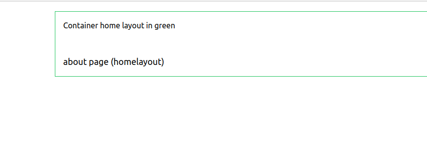
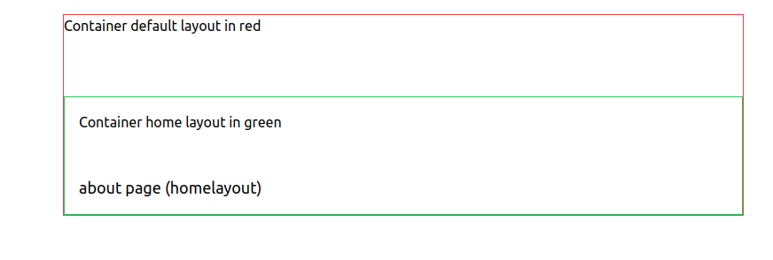

# nuxt-layouts

Test Layouts with router.options

When I have a router.options.ts file in app directory, my page "about" with home layout 
is embed in default.layout

Whe I remove app/router.options.ts file , my page "about" is only with home layout

```vue
<!--pages/about.vue-->
<script setup>
definePageMeta({
    layout: false //remove default layout, this is not working when file app/router.options.ts is present
})
</script>
```

**Without router.options**


**With  router.options**

